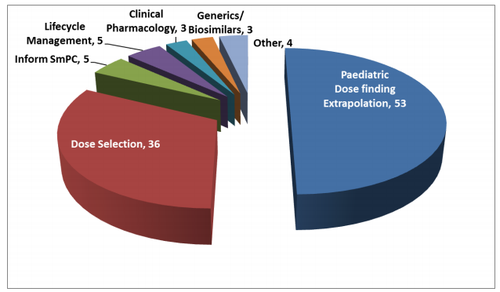

# Modeling and Simulation을 이용한 Special population에서의 약물 인허가 현황

## FDA

- Esomeprazole in Pediatrics for the Treatment of Gastroesophageal Reflux Disease with Erosive Esophagitis: Intravenous Dose Selection (Mehrotra, 2016, Drug Metabolism and Disposition)
- Approval of Vigabatrin for Refractory Complex Partial Seizures in Pediatrics (Mehrotra, 2016, Drug Metabolism and Disposition)
- Adalimumab: Crohn’s Disease in Children: Dose Selection (Mehrotra, 2016, Drug Metabolism and Disposition)
- Darunavir : Exposure-Response and PK Matching to Bridge Dosing for Different Patient Populations in Pediatrics for the Treatment of Human Immunodeficiency Virus (Mehrotra, 2016, Drug Metabolism and Disposition)
- Topiramate: Topiramate Dosing Regimen was Derived by Matching Steady State Trough Concentrations (CMIN) for Different Age Groups 
- Pralidoxime: Derived and recommended Pediatric Dosing Recommendations without any empirical data
- Peramivir: Derived and recommended Pediatric Dosing Recommendations without any empirical data

## EMEA

- 2015년 EMEA MSWG (Modeling and Simulation Working Group)에 의뢰된 관련 업무의 사례 수 (Figure 1)

## PMDA

- 2014년에서 2016년까지  PBPK를 사용한 17 개의 NDA 제출 (2017, Sato, CPT Pharmacometrics Syst. Pharmacol)

# Modeling and Simulation 관련규정

## FDA

### 일반론

- Guidance for Industry End-of-Phase 2A Meetings <https://www.fda.gov/downloads/Drugs/.../Guidances/ucm079690.pdf>

### 소아

- 1994, Pediatric Labeling Rule(Extrapolation Introduced)
- 1997, FDA Modernization Act (FDAMA) (Pediatric Exclusivity – incentive) 
- 2002, Best Pharmaceuticals for Children Act(BPCA) (incentive) 
- 2003, Pediatric Research Equity Act(PREA) (requirement) 
- 2007, FDA Amendments Act(FDAAA) (reauthorized BPCA & PREA) 
- 2012, FDA Safety & Innovation Act(FDASIA) (Permanently reauthorizes BPCA & PREA)
- 2014: General Clinical Pharmacology Considerations for Pediatric Studies for Drugs and Biological Products https://www.fda.gov/downloads/drugs/guidancecomplianceregulatoryinformation/guidances/ucm425885.pdf

## EMEA

- 2016, Reflection paper on extrapolation of efficacy and safety in paediatric medicine development <http://www.ema.europa.eu/docs/en_GB/document_library/Regulatory_and_procedural_guideline/2016/04/WC500204187.pdf>
- 2016, Guideline on the qualification and reporting of physiologically based pharmacokinetic (PBPK) modelling and simulation http://www.ema.europa.eu/docs/en_GB/document_library/Scientific_guideline/2016/10/WC500213940.pdf
- Guideline on the qualification and reporting of physiologically based pharmacokinetic (PBPK) modelling and simulation
http://www.ema.europa.eu/docs/en_GB/document_library/Scientific_guideline/2016/07/WC500211315.pdf

## PMDA

- 영어 자료가 제한되어 의미있는 자료를 아직 찾지 못하였습니다.
