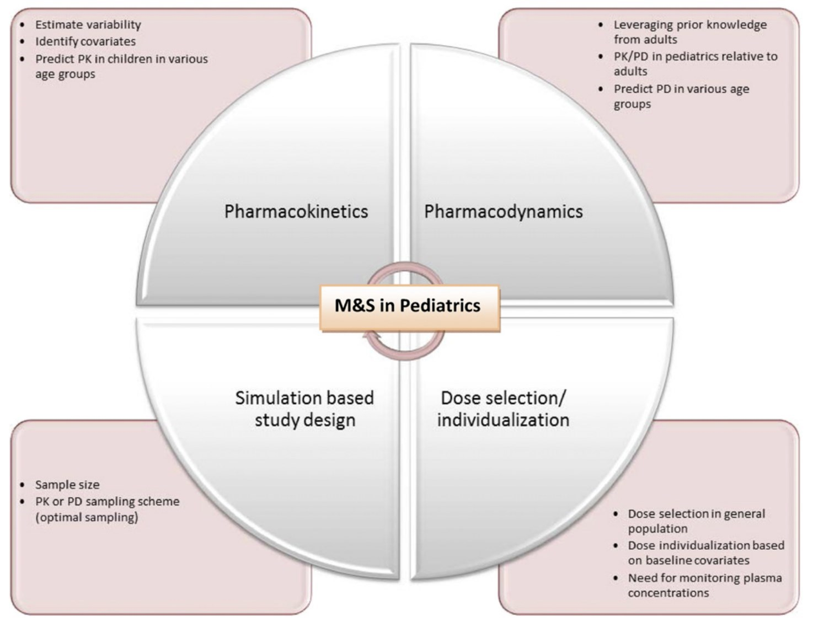
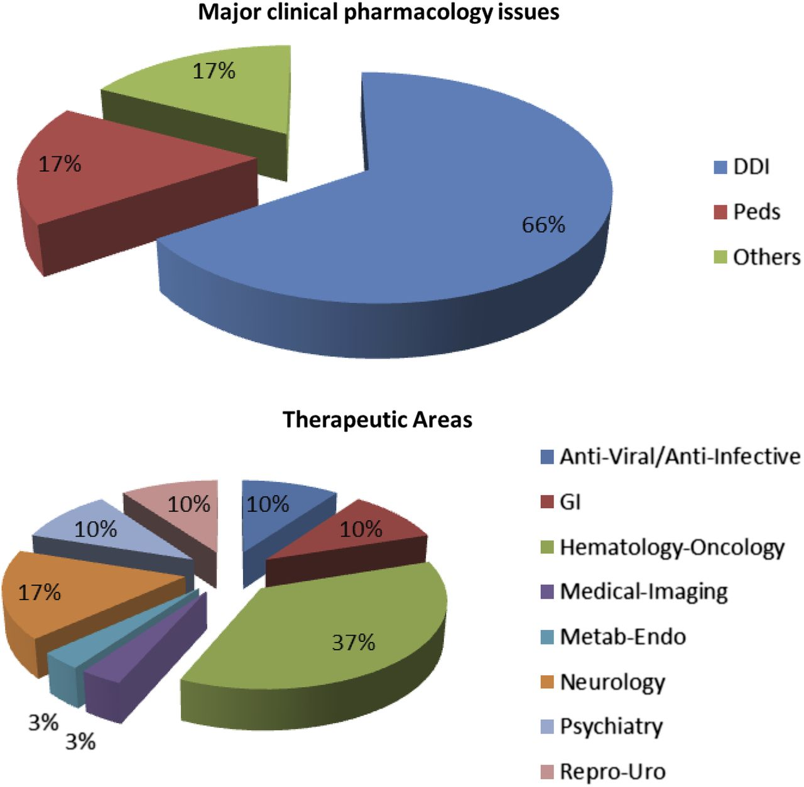
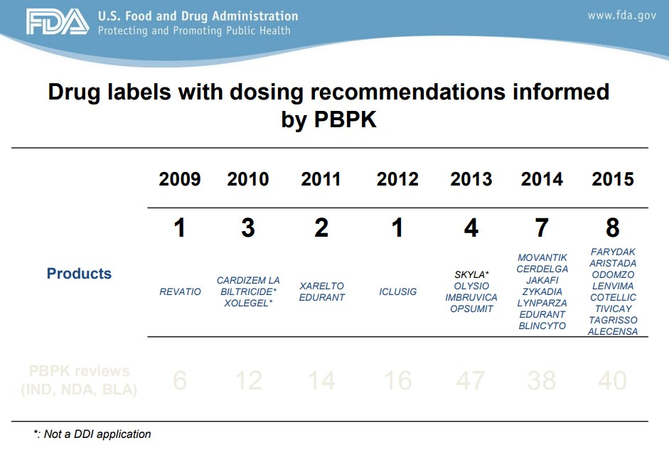
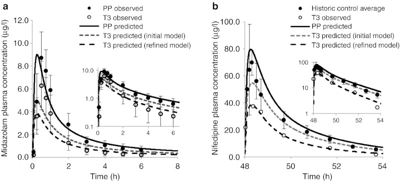
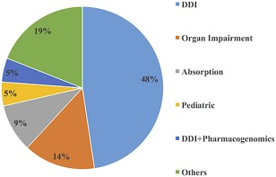

```{r setup, include = FALSE}
library(knitr)
library(tidyverse)
opts_chunk$set(
error = TRUE,
echo = FALSE,
out.width = 800
)

read_csv_kr <- function(x) read_csv(x, locale = locale(encoding='CP949'))
```

# 서론 {#intro}

임상약리학에서 정의하는 특수집단이란 노인, 간장애, 신장애, 소아, 임산부와 같이 일반 성인과 다른 생리적 특징을 갖는 집단을 말한다.
이들은 같은 용량의 동일한 약물을 사용할지라도 그 효과와 부작용의 발현이 매우 다르게 나타날 수 있기 때문에 약물 처방에 극히 주의해야 한다. 
약물 개발 차원에서 모든 특수집단에 대해 용량을 설정하기 위해 여러 임상시험을 행하는 것이 불가능하거나 엄청난 비용을 감수해야 하기 때문에 여러 방법을 고안해 왔다. 
그러나 그 정확도와 예측력이 현실에서 그다지 좋지 않았고, 이에 따라 과학적인 약물의 사용이 어려웠다. 
최근에는 컴퓨터를 사용한 모델링과 시뮬레이션을 통하여 특수집단에서의 보다 효율적이고 안전한 약물사용을 가능케 하고자 하는 여러 접근이 이루어지고 있고 특히 각 국가/지역의 규제기관은 이를 적극 장려하고 있다.

특히 모델링과 시뮬레이션에서 집단 약동학 접근법을 사용하면, 소아 환자나 노인 환자에서 얻어진 희박한 농도 자료 혹은 불균형하게 설계된(unbalanced designs) 연구로부터 얻어진 자료도 분석이 가능하다. [@kfda]
이는 전형적인 약동학 분석 방법으로는 분석이 어려운데 일반적인 임상시험은 건강한 대상자나 엄선된 환자를 대상으로 하며, 그 대상 집단의 평균적인 정보(예, 시간에 따른 평균 혈중 약물농도)를 얻기 때문이다.
반면 실제 임상 치료 환경에서는 이러한 개체간 변이에 대한 정보가 활용되어야 하고 특수집단에서의 약물 사용도 필요한데, 통상적인 임상시험에서는 의도적인 통제에 의하여 개체간 변이에 대한 정보를 명확하게 얻을 수 없고 특수 집단을 대상으로 임상시험을 수행하기란 더욱 어렵다. 

용량을 결정하는 것은 특수집단에서의 약물 사용에 있어 가장 주된 결정 사항이다.
최근 세계 각국의 규제 기관에서는 특수집단에서 모델 기반 약물 개발에 대해 적극 장려하고 있다. 
계량약리학 혹은 정량적 임상약리학 분야의  모델의 개발에 대해 약동학, 약력학에 영향을 미치는 인자를 발견하게 할 수 있다.
특히 소아와 성인의 약동학 비교를 통하여 용량/노출-반응 관계를 살펴볼 수 있다.
(그림 \@ref(fig:ms-ped))

약물농도와 반응, 생리학적 특성 간의 관계에 대한 이러한 지식은 치료적 약물 모니터 링이 반드시 필요하지 않은 치료법에서도 용량을 설정하는데 있어 필수적인 정보이다. 
전체집단, 소집단, 개인별 대상자에서 최적의 투여 용법을 결정하기 위해서는 위에서 언급한 변이와 관련된 쟁점이 해결되어야 한다. 
신약 개발과 허가 검토 과정에서 최적의 투여방법 설정에 대한 중요성이 높아지면서 집단 약동학 분석의 활용이 크게 늘고 있다. 
집단 약동학 분석은 이러한 유용한 정보를 허가 전에 제공할 수 있으므로, 약물 개발 과정에서 필요시 적절하게 활용하여야 한다.

적절한 약물 사용을 한 모델링과 시뮬레이션을 사용하면 특수집단에서의 약물 사용에 큰 도움을 줄 수 있다. 
소아 임상시험에서 임상약리학적 고려점을 제시한 FDA 문서 [@generalclinpharm] 에서는 소아 약물 개발 과정에서 모델링과 시뮬레이션을 적극 활용할 것을 권고하고 있다.
PBPK(생리학 기반 약물동태, Physiologically based pharmacokinetic modelling)를 사용하며 생리학적 정보를 활용하여 보다 정밀한 모델링과 시뮬레이션이 가능하다. 
이러한
생리학 기반 약물동태 모델링은 다양한 동물 실험을 통하여 개
발된 PBPK 모델에 사람의 생리학적인 특성을 적용하여 사람의
PBPK 모델을 개발해 사람의 혈중과 표적장기에서 약물의 농도
를 예측할 수 있어 다른 어떠한 PK 모델보다 유용한 점이 많
다. 이러한 이유 등으로 인해 PBPK 모델은 현재 미국 FDA,
유럽 EMA, 일본 MHLW 등지에서 약물-약물 상호 작용 등 일
부 임상시험에서는 실제 임상 결과를 보다 효율적으로 예측할
수 있는 좋은 방법으로 소개되고 있고, 해당 가이드라인에 평가
방법의 하나로도 소개되고 있다.

- 약물의 적응증에 해당하는 전형적인 환자 집단에서의 적절한 약동학 정보 수집
- 약물 개발과 평가에서 약동학적 변이 확인 및 측정
약동학에 영향을 줄 수 있는 인구 역학적, 병태생리학적, 환경적, 또는 병용약물과 관련된 요인을 규명하여 약동학적 변이 설명
- 환자 집단에서 발생하는 변이 중 설명되지 않는 변이의 크기를 정량적으로 평가
- 설명되지 않는 변이는 그 정도가 커지면 약물의 안전성과 유효성이 저하될 수 있으므로 중요하다. 개체간 차이뿐 아니라, 장기간 치료 시 정상상태 농도의 전형적인 변화 정도도

<!-- 중요한 정보이다. 약물농도 측정 시 발생하는 오류(error)나 설명할 수 없는 일간 또는 주간 약동학적 변이 등에 의해서도 약물의 농도는 차이가 날 수 있다. 이러한 변이(개체내 잔여 변이(residual intrasubject variability), 시점에 따른 변이(interoccasion variability))의 추정은 치료적 약물 모니터링(Therapeutic Drug Monitoring, TDM)에서 매우 중요하다. -->

```{r ms-ped, fig.cap = '소아에서의 약동/약력학 모델링의 역할 및 고려점'}

```

```{r benefit}
benefit <- '분야,잇점
약동학,"변동성을 예측"'
```

<!--
Dose selection is one of the key decisions made during drug
development in pediatrics. There are regulatory initiatives that
promote the use of model-based drug development in pediatrics.
Pharmacometrics or quantitative clinical pharmacology enables
development of models that can describe factors affecting pharma-
cokinetics and/or pharmacodynamics in pediatric patients. This
manuscript describes some examples in which pharmacometric
analysis was used to support approval and labeling in pediatrics. In
particular, the role of pharmacokinetic (PK) comparison of pediatric
PK to adults and utilization of dose/exposure-response analysis for
dose selection are highlighted. Dose selection for esomeprazole
in pediatrics was based on PK matching to adults, whereas for
adalimumab, exposure-response, PK, efficacy, and safety data
together were useful to recommend doses for pediatric Crohn’s
disease. For vigabatrin, demonstration of similar dose-response
between pediatrics and adults allowed for selection of a pediatric
dose. Based on model-based pharmacokinetic simulations and
safety data from darunavir pediatric clinical studies with a twice-
daily regimen, different once-daily dosing regimens for treatment-
naïvehumanimmunodeficiencyvirus1–infectedpediatricsubjects 3
to<12yearsofagewereevaluated.Theroleofphysiologicallybased
pharmacokinetic modeling (PBPK) in predicting pediatric PK is
rapidly evolving. However, regulatory review experiences and an
understanding of the state of science indicate that there is a lack
of established predictive performance of PBPK in pediatric PK
prediction. Moving forward, pharmacometrics will continue to
play a key role in pediatric drug development contributing to-
ward decisions pertaining to dose selection, trial designs, and
assessing disease similarity to adults to support extrapolation of
efficacy.


When designing the pediatric clinical studies, 348
sponsors should be mindful that modeling and simulation, and pharmacologic considerations, are 349
often critical for the successful completion of a study. Modeling and simulation using all of the 350
information available should therefore be an integral part of all pediatric development programs. 351
The following sections are critically important when developing the clinical pharmacology 352
components of a pediatric study plan. 

장점을 기술. 

- 안전성을 확보
- 적절한 용량의 사용 가능
- 부작용 발생 시 빠른 대처 가능
- 비용 절감
-->

# 모델링과 시뮬레이션을 이용한 특수집단에서 약물 인허가 현황 {#approval}

## 미국 FDA의 인허가에 사용된 예

FDA에서 모델링과 시뮬레이션을 활용한 약물의 허가 사항에서 레이블에 반영되는 예는 증가 추세에 있으며 심사에서 사용되는 경우는 더 많아서 2015년 한해에만 40여개에 이른다. (그림 \@ref(fig:drug-label)) [@drug-label]
2008년에서 2015년까지 FDA의 Office of Clinical Pharmacology에서는 180건의 PBPK 모델링을 사용한 심사가 이루어졌으며  PBPK를 사용한 FDA NDA 제출 현황 및 성격 분류가 제시되었다. (그림 \@ref(fig:fda-status)) [@Mehrotra_2016] 
^[https://www.fda.gov/AboutFDA/CentersOffices/OfficeofMedicalProductsandTobacco/CDER/ucm225044.htm]

```{r fda-status, fig.cap = 'PBPK를 사용한 FDA NDA 제출 현황 및 성격 분류 [@Mehrotra_2016]'}

```

```{r drug-label, fig.cap = '2009-2015년 동안 FDA에서 PBPK에 의한 정보가 약물 레이블에 반영된 예 [@drug-label]' }

```

66%는 약물상호작용에 대한 것이었고 나머지 34%는 소아 환자, 간장애, 신장애 등에 대한 내용으로 PBPK가 활용되었다. 

### 소아

FDA의 소아 환자에 대한 약물 허가에서 예가 제시 되었다. (표 \@ref(tab:fda-list))
여러가지 예가 제시되었지만 소아에서 에소메프라졸을 미란성 식도염을 동반한 GERD 치료시 정맥 투여 용법을 예측하는데 사용한 예를 대표적으로 들 수 있다. [@Mehrotra_2016]
소아용 약물의 개발에서 생리기반 약동학 모델링으로 약물을 평가하여 인허가를 결정하는 다수의 예가 보고되고 있다. [@Leong_2012;@Mehrotra_2016] 

CYP450 효소와 발달 과정의 여러 생리학적 인자를 수치화 하여 PBPK 모델링으로 용량-반응 관계를 평가가능하다. [@Leong_2012] 
네가지 약물에 대해서 각 특성을 정리하였다.

```{r fda-list}
fda_list <- '구분, 약물, 출처
소아,Esomeprazole,"Mehrotra *et al*, 2016"
소아,Vigabatrin,"Mehrotra *et al*, 2016"
소아,Adalimumab,"Mehrotra *et al*, 2016"
소아,Darunavir,"Mehrotra *et al*, 2016"
소아,Topiramate,
소아,Pralidoxime,
소아,Peramivir, 
'

read_csv_kr(fda_list) %>%
  select(1,2) %>%
  kable(caption = 'FDA의 특수 환자에 대한 약물 허가에서 예')
```

1. Esomeprazole in Pediatrics for the Treatment of Gastroesophageal Reflux Disease with Erosive Esophagitis: Intravenous Dose Selection [@Mehrotra_2016]
2. Approval of Vigabatrin for Refractory Complex Partial Seizures in Pediatrics (Mehrotra, 2016, Drug Metabolism and Disposition)
3. Adalimumab: Crohn's Disease in Children: Dose Selection (Mehrotra, 2016, Drug Metabolism and Disposition)
4. Darunavir : Exposure-Response and PK Matching to Bridge Dosing for Different Patient Populations in Pediatrics for the Treatment of Human Immunodeficiency Virus (Mehrotra, 2016, Drug Metabolism and Disposition)
5. Topiramate: Topiramate Dosing Regimen was Derived by Matching Steady State Trough Concentrations (CMIN) for Different Age Groups 
6. Pralidoxime: Derived and recommended Pediatric Dosing Recommendations without any empirical data
7. Peramivir: Derived and recommended Pediatric Dosing Recommendations without any empirical data


### 임산부

임산부를 대상으로 한 임상시험은 극도로 수행하기 힘들거나 불가능하기 때문에 대부분의 약물이 경험적으로 사용되거나 근거없이 사용되고 있다. 용량 뿐만아니라 모체-태아 약동학 및 효력에 대한 종합적인 고려를 위해서는 모델링과 시뮬레이션이 반드시 사용되어야 한다. FDA에서 임산부에서의 PBPK를 활용한 약물의 인허가 관련 내용은 다음 문헌에서 발표되었다. 

- Ke AB, Nallani S, Zhao P, et al. A PBPK Model to Predict Disposition of CYP3A-metabolized Drugs in Pregnant Women: Verification and Discerning the Site of CYP3A Induction. Clin Pharmcol Ther: Pharmacometrics & Systems Pharmacology, 2012 [@Ke_2012]
- Ke AB, Nallani SC, Zhao P, Rostami-Hodjegan A, Isoherranen N, Unadkat JD. A Physiologically Based Pharmacokinetic Model to Predict Disposition of CYP2D6 and CYP1A2 Metabolized Drugs in Pregnant Women. Drug Metab Dispos. 41:801-13. 2013 [@Ke_2013]

```{r pregnancy, fig.cap = "임산부에서 미다졸람과 니페디핀의 임신 중(T3)과 출산 후(PP)의 농도-시간 곡선의 차이. [@Ke_2012]"}

```

임산부에서 CYP3A에 의해 대사되는 약물들인 미다졸람과 니페디핀의 임신 중(T3)과 출산 후(PP)의 농도-시간 곡선의 차이가 나타났으며 이에 따라 임신 중에 투여되어야 하는 약물 용량을 적절히 조정할 수 있다. [@Ke_2012]
또한 CYP2D6, CYP1A2에 의해 대사되는 약물들에 대한 문헌도 출판되어 있다. [@Ke_2013]

### 간장애, 신장애

간장애, 신장애에서의 PBPK 모델링 사용 예가 다음 문헌에서 찾을 수 있다.

- Grillo JA, Zhao P, Bullock J, et al, Utility of a physiologically–based pharmacokinetic (PBPK) modeling approach to quantitatively predict a complex drug–drug–disease interaction scenario for rivaroxaban during the drug review process: implications for clinical practice, Biopharm Drug Dispo, 2012
- Zhao P, de LT Vierira M, Grillo J, et al, Evaluation of Exposure Change of Non-renally Eliminated Drugs in Patients with Chronic Kidney Disease Using Physiologically-based Pharmacokinetic Modeling and Simulation.  J Clin Pharmacol, 2012

<!--Based on the PBPK review knowledgebase of the Office of Clinical Pharmacology, there are 180 records between 2008 and 2015 addressing various clinical pharmacology issues. Sixty-six percent of these records fall into the category of predicting drug-drug interaction potential, with the remaining 34% equally distributed between pediatric PK prediction and other applications (e.g., drug absorption, pharmacogenetics, and organ impairment) (Fig. 5). Of the 31 pediatric review records, distribution of therapeutic areas is shown in Fig. 5. Based on the regulatory experience, compared with drug-drug interaction prediction, the confidence in prospectively using PBPK predictions to recommend pediatric dosing regimen is lower. The lower confidence in using PBPK to predict drug PK in pediatrics is mainly attributed to uncertainty and knowledge gaps in developmental changes governing absorption, distribution, metabolism, and excretion processes mediated by metabolizing enzymes, binding proteins, and transporters. Therefore, one anticipates the system model for the pediatric population of a specific age group to be updated when new information becomes available. Salem and colleagues (2014) recently used clinical PK data for CYP3A substrates to derive and update the ontogeny profile for the enzyme. At the present time, the use of PBPK in regulatory submissions focuses on optimizing the study design of pediatric PK studies with the goal of maximizing the utility of knowledge gained from these studies upon completion. The regulatory review experiences and understanding of the state of science led to the conclusion that there is a lack of established predictive performance of PBPK in the area of pediatric PK prediction (Wagner et al., 2015).-->

<!--Mehrotra의 서론 부분을 요약.-->

## 유럽 EMEA의 인허가에서 사용된 예

2013년에 설립된 MSWG은 EMEA 내외의 다수의 계량약리학자들로 구성되어 있어 모델링과 시뮬레이션을 사용한 심사의뢰에 대해 분석 및 평가를 수행한다. 
2015년 EMEA MSWG (Modeling and Simulation Working Group)에 의뢰된 관련 업무의 사례 수 (그림 \@ref(fig:mswg))가 공개되어 있으며, 의뢰된 모델링과 시뮬레이션 관련 업무에서 가장 많은 비중을 차지하는 것은 소아에서 용량 결정하는 것(53%, paediatric dose finding extrapolation) 이었다. 

```{r mswg, fig.cap = '2015년 EMEA MSWG (Modeling and Simulation Working Group)에 의뢰된 관련 업무의 사례 수. Reference: http://www.ema.europa.eu/docs/en_GB/document_library/Report/2017/03/WC500222778.pdf'}
include_graphics('assets/emea.png')
```
<!--The Modelling and Simulation Working Group (MSWG) was established in January 2013 to provide
specialist scientific support to the SAWP, PDCO and CHMP in the form of feedback on technical issues
around how companies propose to use modelling and simulation in support of registration dossiers.
The drivers for establishing such a group came from both internal and external sources.
From January 2016 to December 2016, 105 product related procedures were referred to the MSWG
with 41 from PDCO, 62 from SAWP, 2 from CHMP and 7 Guidelines. A breakdown of the scope of
questions addressed by M&S is shown in the pie chart below:
Scope of M&S in regulatory submissions as experienced by MSWG-->


## 일본 PMDA의 인허가에서 사용된 예

2016년 10월부터 일본의 PMDA는 전자 문서로 NDA를 받기 시작하였다. 
이를 통하여 모델링과 시뮬레이션이 포함된 NDA에 대한 정보를 조회하는 것이 보다 용이해 졌으며 Sato 등은 이를 요약하여 논문으로 제시하였다. [@Sato_2017]
2014년에서 2016년까지 PBPK를 사용한 17개의 NDA가 PMDA에 제출되었다. (그림 \@ref(fig:pmda))

```{r pmda, fig.cap = 'PBPK가 사용되어 작성된 17개 약물 NDA의 분류 [@Sato_2017]'}

# df <- read_csv('class,value
# DDI,48
# Organ Impairment,14
# Absorption,9
# Pediatric,5
# DDI+Pharmacogenomics,5
# Others,19')

# ggplot(df, aes(x = '', y = value, fill = class))+
#   geom_col(width = 1) +
#   #geom_bar(width = 1, st0at = "identity") +
#   coord_polar(theta = "y") +
#   theme(axis.text = element_blank(),
#         axis.ticks = element_blank(),
#         panel.grid  = element_blank())
```

<!--In Japan in October 2016, the Pharmaceuticals and Medical Devices Agency (PMDA) began to receive electronic data in new drug applications (NDAs). These electronic data are useful to conduct regulatory assessment of sponsors’ submissions and contribute to the PMDA's research. In this article, we summarize the number of submissions of quantitative modeling and simulation (M&S) documents in NDAs in Japan, and we describe our current thinking and activities about quantitative M&S in PMDA.-->


# 모델링과 시뮬레이션 관련 규정 {#regulation}

제약 산업 종사자와 규제기관은 특수집단에서의 안전성 및 유효성 분석 등에 있어 모델링과 시뮬레이션 혹은 집단 약동학/약력학의 활용에 대해 오랜 기간 동안 관심을 가져왔다. [@kfda]
이러한 관심을 바탕으로 다양한 가이드라인이 존재하지만 가장 대표적으로 International Conference on Harmonisation (ICH)는 다음의 가이드라인에서 모델링과 시뮬레이션에 대해 다루고 있다. 

- International Conference on Harmonisation (ICH) guidance: 
E4 Dose-Response Information to Support Drug Registration [@E4] and 
E7 Studies in Support of Special Populations: Geriatrics [@E7]

이러한 가이드라인들은 약물 개발에 있어 약동학 평가의 일부로서 집단 약동학 접근법 (population pharmacokinetic approach)과 같은 특별한 자료 수집과 분석 기법을 약동학 평가에 사용 하는 근거를 제공한다.
아울러 전 세계적으로 모델링과 시뮬레이션으로 얻어진 정보를 규제기관에서 적절히 활용하기 위해서 미국 FDA, 유럽의 EMA, 일본의 PMDA와 캐나다의 Health Canada는 정기적으로 원격회의, 혹은 미팅을 통해 의견과 정보를 교환하고 있으며 [@Sato_2017], 각국의 사정에 맞춘 독자적인 가이드라인도 활발히 제시하고 있다.

## 미국 FDA의 관련 규정

FDA는 독자적으로 계량약리학 파트를 운영하고 있으며 이를 약물 심사에 적극 활용하고 있다.
활발히 가이드라인을 출판하고 있다. (표 \@ref(tab:fda-guide))

```{r fda-guide}
df <- '년도,관련규정
2014,General Clinical Pharmacology Considerations for Pediatric Studies for Drugs and Biological Products
2017,Physiologically Based Pharmacokinetic Analyses-Format and Content Guidance for Industry.'

read_csv_kr(df) %>%
  kable(caption = '미국 FDA의 모델링/시뮬레이션 관련 지침 (guidance)')
```

FDA에서 발행하는 임상 2A상 후 미팅에서 특수집단의 약동학과 약력학에 대한 본격적인 고려를 하게 된다. [@fda2a]
특히 소아에서의 약물 사용에 관한 인허가 규정에는 모델링과 시뮬레이션에 대한 내용이 빠짐없이 들어가 있다. (표 \@ref(tab:fda-ped))

```{r fda-ped}
df <- '년도,관련규정
1994,Pediatric Labeling Rule(Extrapolation Introduced)
1997,FDA Modernization Act (FDAMA) (Pediatric Exclusivity – incentive) 
2002,Best Pharmaceuticals for Children Act(BPCA) (incentive) 
2003,Pediatric Research Equity Act(PREA) (requirement) 
2007,FDA Amendments Act(FDAAA) (reauthorized BPCA & PREA) 
2012,FDA Safety & Innovation Act(FDASIA) (Permanently reauthorizes BPCA & PREA)
2014,General Clinical Pharmacology Considerations for Pediatric Studies for Drugs and Biological Products'

read_csv_kr(df) %>%
  kable(caption = '미국 FDA의 소아 관련 약물 인허가 규정')
```

<!--https://www.fda.gov/downloads/drugs/guidancecomplianceregulatoryinformation/guidances/ucm425885.pdf-->

## 유럽 EMA의 관련 규정

EMEA도 모델링과 시뮬레이션에 대한 가이드라인을 활발히 제시하고 있다. [@extrapol;@pbpk] 
외삽을 통한 방법도 전통적으로 많이 사용되어 왔으나 현재 EMEA에서는 존재하는 자료를 분석하고 합성하여 모델링과 시뮬레이션 하는 것을 권장하고 있다. [@extrapol]

소아에서 PBPK [@pbpk]

```{r ema-approval}
df <- '년도,가이드라인
2016,Reflection Paper on Extrapolation of Efficacy and Safety in Paediatric Medicine Development. [@extrapol]
2016,Guideline on the Qualification and Reporting of Physiologically Based Pharmacokinetic (PBPK) Modelling and Simulation. [@pbpk]'

read_csv_kr(df) %>%
  kable(caption = '유럽 EMA의 모델링과 시뮬레이션 가이드라인')
```

## 일본 PMDA의 관련 규정

아직 일본에서는 공식적으로 모델링에 대한 가이드라인이 출판되지 않은 상태이지만 초안(draft) 형태가 곧 공개 예정이다. [@Sato_2017]

<!--영어 자료가 제한되어 의미있는 자료를 아직 찾지 못하였습니다.-->

# 참고문헌 {-}

```{r eval = FALSE}
knitr::write_bib(file = 'bib/packages.bib')
```

